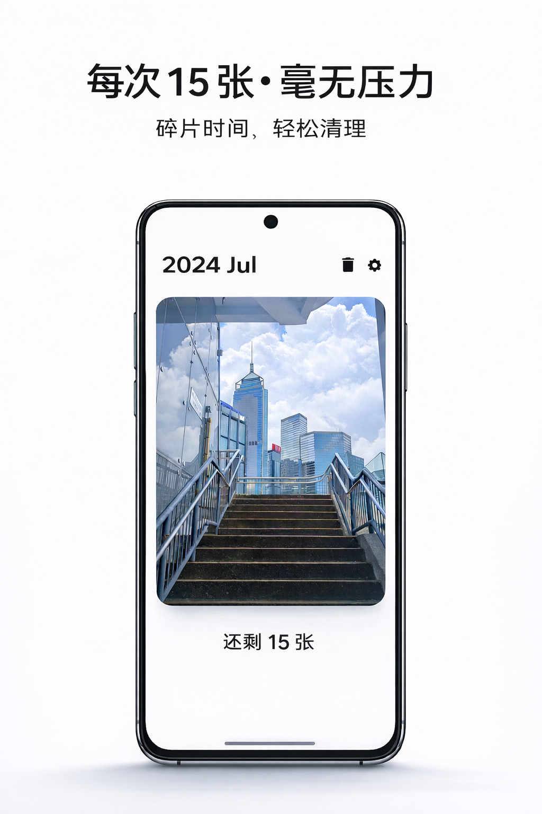
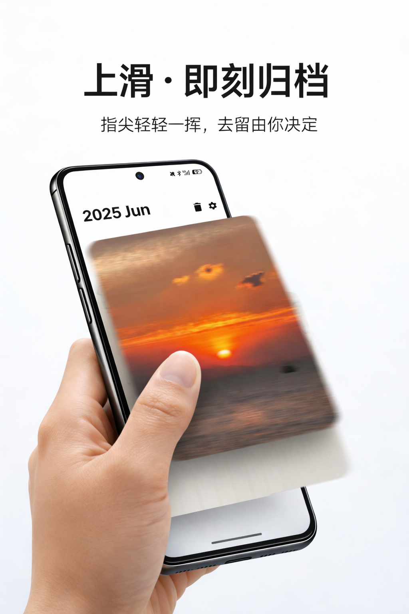
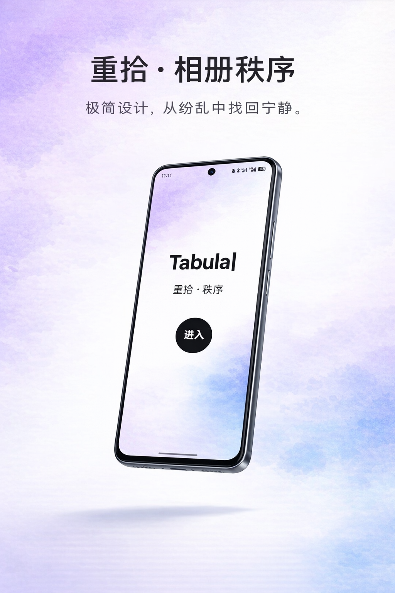

  

<h1 align="center">Tabula | 重拾 · 秩序</h1>

  <strong>极简主义相册整理工具 / Minimalist Photo Cleaner</strong>

  
  
  

## 最新版本TabulaV3 
https://github.com/Doryoku1223/TabulaV3

  Tabula 帮你重新发现与整理你的回忆。 
  没有繁杂的干扰，只有纯粹的整理体验。

---

## :sparkles: 最新发布 (Latest Release)

> **:calendar: 更新日期：2026.1.11**
>
> **:label: 版本：v1.0.5**

### :rocket: 本次更新说明
* **:new: 新增**：全新的“随机漫步”清理模式，每次随机抽取 15 张照片。
* **:art: 优化**：重构了设置页面 UI，采用黑白极简风格。
* **:point_up_2: 体验**：优化了滑动卡片的手感，左滑保留，上滑归档。

### :inbox_tray: [点击下载最新 APK (Download .apk)](https://github.com/Doryoku1223/Tabula/releases/download/v1.0.5/TabulaV1.0.5.apk)

---

## :iphone: 应用预览 (Showcase)

<table align="center" style="border:none;">
  <tr>
    <td align="center" width="33%">
      
       
      <b>极简主页</b> 
      每次 15 张，无压清理
    </td>
    <td align="center" width="33%">
      
       
      <b>直觉交互</b> 
      上滑删除，左右保留
    </td>
    <td align="center" width="33%">
      
       
      <b>设计美学</b> 
      纯粹的视觉体验
    </td>
  </tr>
</table>

> *“在整理相册的过程中，不仅是释放空间，更是与回忆的一次次重逢。”*

---

## :star2: 核心特性 (Features)

* **:beginner: 禅意模式**：拒绝焦虑，每次只推送 15 张照片，碎片时间即可完成整理。
* **:point_up: 手势操作**：借鉴卡片式交互，左滑/右滑/上滑，单手即可轻松操作。
* **:shield: 隐私优先**：**仅本地处理 (Local Only)**。Tabula 不需要联网权限，您的照片绝不会上传到任何服务器。
* **:moon: 深色模式**：完美适配 Android 深色主题，夜间整理更护眼。
* **:wastebasket: 后悔药机制**：所有删除操作进入“回收站”，给您二次确认的机会。

---

## :lock: 隐私承诺 (Privacy Policy)

我们深知照片是您最私密的数据。
**Tabula 承诺：**
1. :no_entry_sign: 不申请互联网权限。
2. :eye_off: 不收集任何用户行为数据。
3. :mobile_phone_off: 所有图片处理（分析、删除）均在您的手机本地完成。

---

## :speech_balloon: 反馈与建议 (Feedback)

如果您在使用过程中遇到 Bug，或有新的功能建议，欢迎通过以下方式联系：

* 提交 [Issues](https://github.com/Doryoku1223/Tabula/issues)

---

  Made with :heart: for Android

